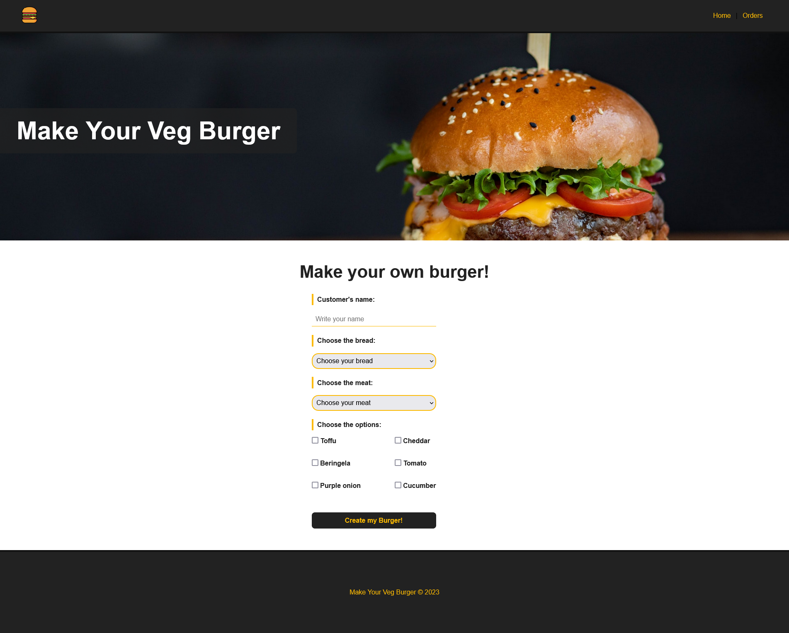
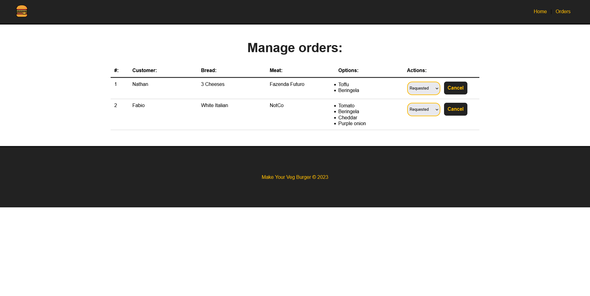

# Make Your Veg Burger
First project in Vue. Made together with youtuber Matheus Battisti.

# Gif

# Screenshots



## Project setup
```
npm install
```

### Compiles and hot-reloads for development
```
npm run serve
```

### Compiles and minifies for production
```
npm run build
```

### Customize configuration
See [Configuration Reference](https://cli.vuejs.org/config/).
